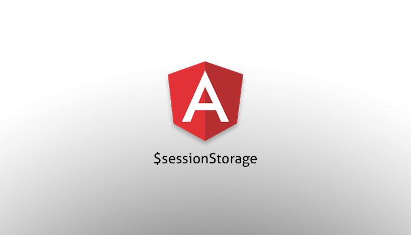

# angular-swx-session-storage

  

$sessionStorage service for use in your AngularJS applications.

Provides a key-value (string-object) storage, that is backed by localStorage with support for expiry (in days).

Objects put or retrieved from this storage are automatically serialized or deserialized by angular's toJson/fromJson.

## Installation

Node Package Manager:

    npm install --save-dev angular-swx-session-storage

Bower:

    bower install angular-swx-session-storage

## Usage

Simply add the angular-swx-session-storage assets to your project and include them in your HTML or as part of your build process.

    

angular-swx-session-storage.js should appear after angular.js is included.
Prefer minified assets (.min) for production.

    myApp.$inject = ['$sessionStorage'];
    function myApp($sessionStorage) {
        // Your app code...
    }

    angular
        .module('myApp', ['swxSessionStorage']);

## Dependencies

angular-swx-session-storage depends on angular.js, and is tested on version 1.3.14.

## Supported Browsers

angular-swx-session-storage will function correctly within all browsers that support [Web Storage][].

For browsers with Web Storage disabled or in private browsing mode; a simple session Object fallback is used - **please be aware of the limitations in this scenario**.

# Contributing
If one of the existing models doesn't meet your needs, fork the project, implement the model and an example using it, send us a pull request, for consideration for inclusion in the project.

A few rules for pull requests

* Please commit to the development branch
* All new features must come with unit test coverage
* Bug fixes should come with unit tests that prove their fix
* Everything should include [ngdoc][] code comments.

## Builds

First clone the repository and checkout the "development" branch
make sure nodejs is installed via your system's package manager.
Install [gulp.js][]: npm install -g gulp
have node download it's required modules with: npm install

Once completed; there are a number of build options available; each build process will automatically check and install dependencies through [bower][].

### Developemnt build
To generate a development build:

    gulp

This will run all tests and generate a development build; the build version will be updated v0.0.1 becomes v0.0.1-0.

### Patch build
To generate a patch build:

    gulp patch

This will run all tests and generate a patch build; the patch version will be updated v0.0.1-0 becomes v0.0.2.

### Minor release build
To generate a minor release build:

    gulp build

This will run all tests and generate a minor release build; the minor version will be updated v0.0.2 becomes v0.1.0.

### Major release build
To generate a major release build:

    gulp release

This will run all tests and generate a major release build; the major version will be updated v0.1.0 becomes v1.0.0.

## Documentation

Documentation is generated from [ngdoc][] code comments within the JavaScript source.

This documentation can be found within the **'./docs/'** folder.

## Tips for Testing

Unit tests are written in Jasmine.

In order to run tests without generating a build use:

    gulp test:js

If you have NOT yet generated a build (as detailed above); the [bower][] packages may not be installed and tests will fail as a result of this.

In order to install the dependencies use the following and then re-run your tests.

    bower install

Scriptwerx now uses Travis CI for continuous integration. Visit our travis build page [here](https://travis-ci.org/scriptwerx) to see the latest status.

## Development &amp; Issue Tracking

We use [JIRA][] to capture and organize issues, assign work, and follow team activity.

You can view this project [here](https://scriptwerx.atlassian.net/projects/SESSTORAGE).

---

The MIT License (MIT)

Copyright (c) 2015 scriptwerx

Permission is hereby granted, free of charge, to any person obtaining a copy
of this software and associated documentation files (the "Software"), to deal
in the Software without restriction, including without limitation the rights
to use, copy, modify, merge, publish, distribute, sublicense, and/or sell
copies of the Software, and to permit persons to whom the Software is
furnished to do so, subject to the following conditions:

The above copyright notice and this permission notice shall be included in all
copies or substantial portions of the Software.

THE SOFTWARE IS PROVIDED "AS IS", WITHOUT WARRANTY OF ANY KIND, EXPRESS OR
IMPLIED, INCLUDING BUT NOT LIMITED TO THE WARRANTIES OF MERCHANTABILITY,
FITNESS FOR A PARTICULAR PURPOSE AND NONINFRINGEMENT. IN NO EVENT SHALL THE
AUTHORS OR COPYRIGHT HOLDERS BE LIABLE FOR ANY CLAIM, DAMAGES OR OTHER
LIABILITY, WHETHER IN AN ACTION OF CONTRACT, TORT OR OTHERWISE, ARISING FROM,
OUT OF OR IN CONNECTION WITH THE SOFTWARE OR THE USE OR OTHER DEALINGS IN THE
SOFTWARE.

---

[JIRA]: http://www.atlassian.com/software/jira
[Web Storage]: http://caniuse.com/#feat=namevalue-storage
[gulp.js]: http://gulpjs.com
[bower]: http://bower.io
[ngdoc]: https://github.com/angular/angular.js/wiki/Writing-AngularJS-Documentation
